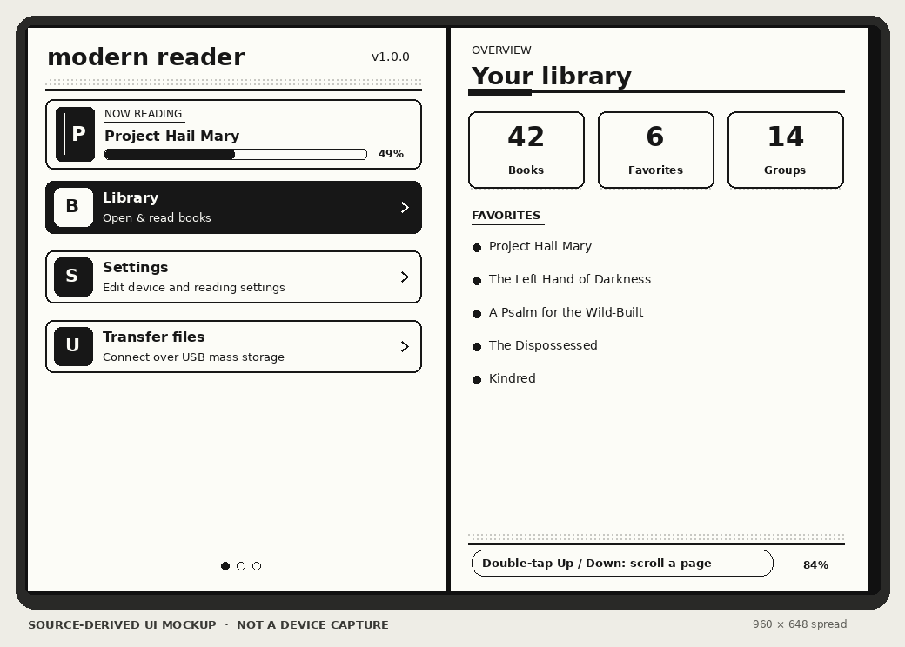
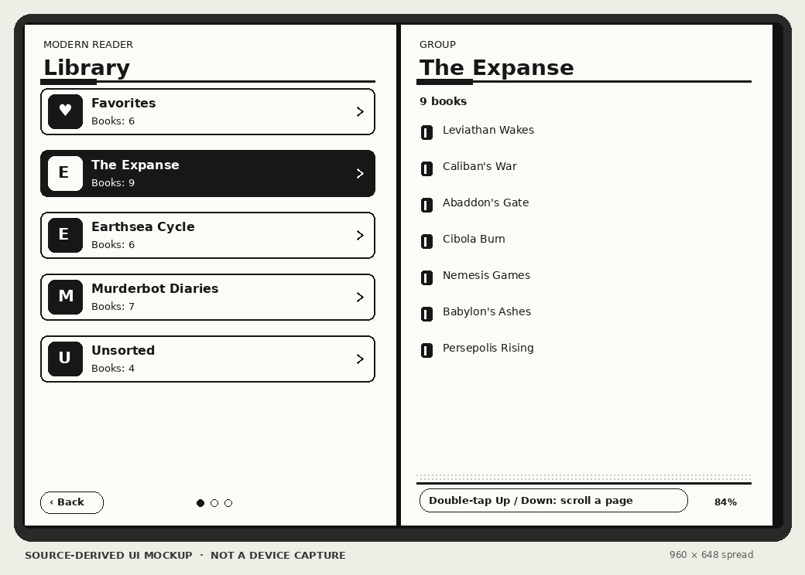
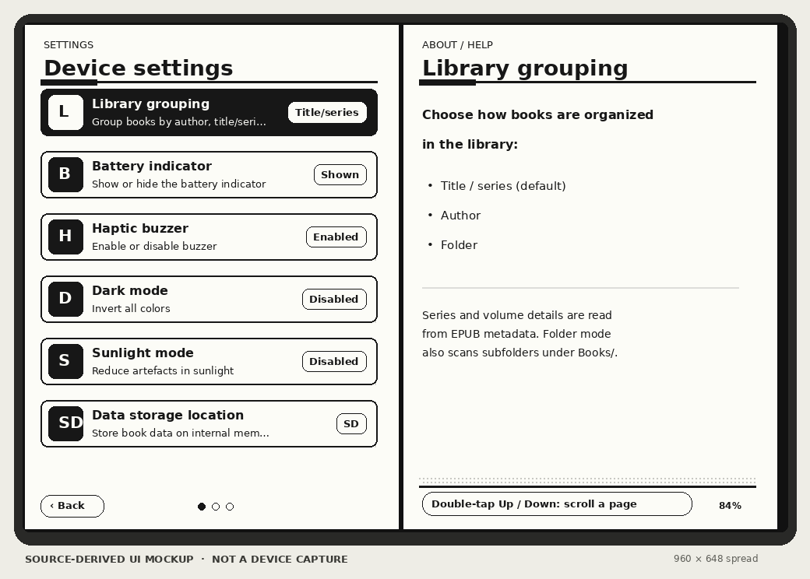
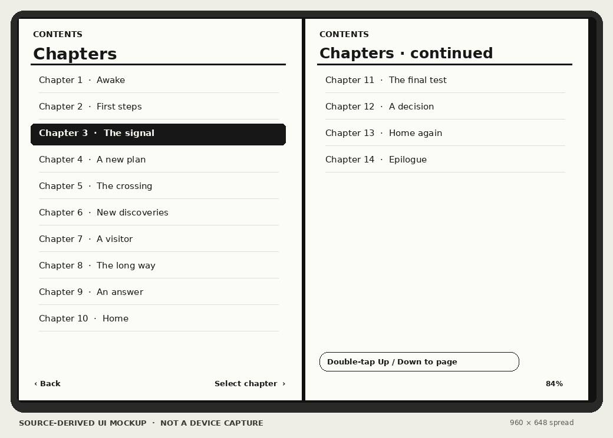

# ModernReader - An Diptyx E-Reader Firmware

**A community firmware fork for the Diptyx E-reader**  
Modern Reader **1.0.0** is based on the original Diptyx firmware **1.0.2**.

Modern Reader keeps the original e-reader hardware and adds a more useful library, a redesigned two-page menu, improved EPUB image support, and fixes for USB and SD-card reliability. It is an independent project—not an official Diptyx release.

> **Important:** This firmware is intended for the Diptyx E-reader hardware. The binaries in `firmware_release/` named `diptyx_firmware_*.bin` are unchanged upstream Diptyx releases, not Modern Reader builds. The Modern Reader 1.0.0 clean-install image is [`firmware_release/ModernReader_v1.0.0_merged.bin`](firmware_release/ModernReader_v1.0.0_merged.bin); see [Flashing](#flashing) before using it.

## What’s new compared with Diptyx 1.0.2

| Area | Modern Reader additions |
| --- | --- |
| **Library** | Group books by **title/series** (the new default), author, or folder. Series and volume are read from Calibre and EPUB 3 metadata and cached with book data; volume numbers use natural ordering, with filename numbers checked before the EPUB series index, then title, and unnumbered books last. The scanner finds EPUBs in the SD-card root and recursively inside `Books/`. In folder mode each folder is a group and books outside folders appear under **Unsorted**. Favorites stay at the top, and leading articles are ignored for alphabetical grouping. |
| **Finding books** | A **Now reading** card and a newest-first recent-books list make it easy to return to a book. Library groups and titles ignore leading “The”, “A”, and “An” when sorted alphabetically. |
| **Interface** | A new monochrome card-based menu with icon/letter tiles, a scrollbar, page dots, button hints, and a dithered header. The second display page gives context-sensitive library and group summaries, book details (cover, author, series, progress, and favorite state), and setting descriptions. The right button adds or removes a selected book from Favorites. Manual and Firmware info are now under Settings. Double-tap **Up/Down** to move a full page through long lists. |
| **Reading** | A full-screen chapter list and quick menu provide chapter navigation, Dark mode, Sunlight mode, page/percentage progress, and a shortcut back to the Library. Moving backward from the first spread or forward past the last spread returns to the Library. Holding Center no longer immediately opens and closes the quick menu. |
| **EPUB images** | Adds progressive-JPEG decoding for illustrations that the old baseline-only decoder could not display. It reads grayscale brightness and can reduce large images to save memory (the change log estimates about 1 MB for a 1404 × 2000 image; it reports a 2–3 gray-level mean difference from a full decode at reduced size, and an exact result at full size). Large images without a specified size are scaled proportionally instead of squeezed. Image extensions are matched without regard to case, and PNG covers are accepted. |
| **USB and storage** | Fixes a crash when entering USB file-transfer mode; retries SD-card initialization at lower speeds for 64 GB SDXC cards; and avoids mounting the SD card from inside the TinyUSB task while increasing that task’s stack. Transfer failures now show the failing stage and error code. After a brownout, crash, or watchdog reset, startup can show the last transfer stage reached. |
| **Identity and docs** | The firmware and USB product/manufacturer identity are **Modern Reader**. The built-in Manual and Firmware info pages are updated, with credits, fork information, and the change log. Build dependencies are pinned for more reproducible builds. |

The full release-by-release details are in [`firmware_source/CHANGELOG.md`](firmware_source/CHANGELOG.md). The changes are also available on-device under **Settings → Firmware info**.

## Release 1.0.0

The prebuilt **full clean-install** image is [`ModernReader_v1.0.0_merged.bin`](firmware_release/ModernReader_v1.0.0_merged.bin), with its [SHA-256 checksum](firmware_release/ModernReader_v1.0.0_merged.bin.sha256). It contains the bootloader, partition table, Modern Reader application, and built-in Manual/Firmware info assets. This is a full-flash image, not an in-place update; it erases existing device data.

## UI previews

These are **source-derived mockups**, not photographs or captures from a running device. They illustrate the new menu layout using sample book titles; exact text and appearance can vary with device state and firmware rendering.

| Home and library overview | Series-based library |
| --- | --- |
|  |  |

| Device settings | Chapter navigation |
| --- | --- |
|  |  |

## Compatibility

- **Device:** Diptyx E-reader hardware (ESP32-S3-based). This is not a general-purpose ESP32 firmware.
- **Books:** EPUB files on the SD card. Put them in the card’s root or under `Books/`; subfolders are scanned too.
- **Build target:** `esp32-s3-devkitm-1`, with the Diptyx firmware’s board configuration and 16 MB flash layout.

## Build from source

The firmware is built with PlatformIO and ESP-IDF. Install [PlatformIO](https://platformio.org/install) (the PlatformIO IDE extension for VS Code or the PlatformIO CLI), then run:

```sh
cd firmware_source
pio run -t buildfs
pio run
```

The project pins `espressif32@6.13.0` and `esp_littlefs` v1.20.4. Build outputs are placed under `firmware_source/.pio/build/esp32-s3-devkitm-1/`. The `pio run` post-build script also assembles `merged.bin` from the bootloader, partition table, application, and assets image.

## Flashing

Flashing firmware can erase books or settings if the wrong image or address is selected. Back up anything important first, and only flash a device you know is compatible.

To enter the device’s USB flash mode, turn it fully off for about 20 seconds, then hold the center joystick while connecting USB-C. Use an ESP32-S3-compatible flasher (a browser-based flasher requires a browser with WebSerial support).

| File | Flash address | What it does |
| --- | ---: | --- |
| `firmware_release/ModernReader_v1.0.0_merged.bin` | `0x0000` | Prebuilt Modern Reader 1.0.0 full clean install. Includes bootloader, partition table, application, and assets; overwrites device flash and erases existing settings, book data, and metadata. |
| `firmware_source/.pio/build/esp32-s3-devkitm-1/firmware.bin` | `0x10000` | Updates the application. This is the usual source-build path when you want to keep the existing settings and book storage. |
| `firmware_release/modern-reader-assets-littlefs.bin` | `0x910000` | Updates only the 1 MB assets partition containing the built-in Manual and Firmware info EPUBs. It does not replace the application or the separate book-storage partition. |
| `firmware_source/.pio/build/esp32-s3-devkitm-1/merged.bin` | `0x0000` | Full merged image produced by a source build. Like the prebuilt image, it overwrites device flash; back up first. |

The supplied `modern-reader-assets-littlefs.bin` is **not a complete firmware image**. It is safe to omit if you are only updating the application. Rebuild it from `firmware_source/data/` with `pio run -t buildfs` when changing the built-in EPUBs. A full flash at `0x0000` can erase books and settings; back up first. The prebuilt 1.0.0 image was compiled successfully but has not been verified on physical hardware.

The legacy `diptyx_firmware_1.0.1*` and `diptyx_firmware_1.0.2*` files in `firmware_release/` are retained from the original project for reference. They are byte-for-byte identical to the upstream files and do **not** contain the Modern Reader fork.

## Repository layout

```text
firmware_source/       Modern Reader source, build configuration, manual, and change log
firmware_release/      Modern Reader 1.0.0 clean-install image, assets image, and inherited upstream files
docs/images/           Source-derived UI preview mockups
README.md              Project overview and usage notes
LICENSE                MIT license
```

## Forking and attribution

This repository is a community fork of the [original Diptyx project](https://github.com/MartijndenHoed/Diptyx). Use GitHub’s **Fork** button if you want your own linked copy. Modern Reader is independent and is not affiliated with, endorsed by, or supported by Diptyx. Keep the [notice](firmware_source/NOTICE.md), MIT [license](LICENSE), and third-party license notices with redistributed copies.

## Credits and license

Modern Reader is based on the [Diptyx E-reader firmware](https://github.com/MartijndenHoed/Diptyx) by Martijn den Hoed and the Diptyx team. It is not affiliated with, endorsed by, or supported by Diptyx. See [`firmware_source/NOTICE.md`](firmware_source/NOTICE.md) for attribution and [`LICENSE`](LICENSE) for the MIT license. Third-party components remain under their own licenses.
